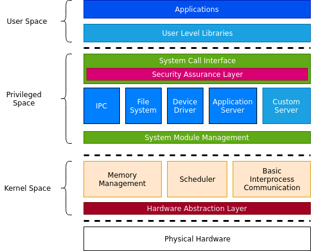

## Philosopher's Stone
**Philosopher's Stone** is an 64bit operating system project to harden my knowledge about system programming. This project is motivated from the open source operating system **MINT64**, which is described as an example of the book series "The Principles and Structures of 64bit Multicore Operating System"(Kor: 64비트 멀티코어 OS 원리와 구조) written by Seunghoon Han. 

## Architecture
The kernel design of Philosopher's Stone follows typical [Microkernel Architecture](https://en.wikipedia.org/wiki/Microkernel). There are 3 spaces on the diagram below, kernel space, privileged space, and user space. 

    

Unlike linux's monolithic design, Philosopher's Stone has only three features while others are separated as independent module. Kernel works with foundational resources such as Memory, Task Scheduling, and Basic Interprocess Communication. Other features are placed on Privileged space, which provides system interface to user to utilize system. 

## License
Kernel source of Philosopher's Stone is licensed under MIT License.

Copyright 2019 PS64 Project

Permission is hereby granted, free of charge, to any person obtaining a copy of this software and associated documentation files (the "Software"), to deal in the Software without restriction, including without limitation the rights to use, copy, modify, merge, publish, distribute, sublicense, and/or sell copies of the Software, and to permit persons to whom the Software is furnished to do so, subject to the following conditions:

The above copyright notice and this permission notice shall be included in all copies or substantial portions of the Software.

THE SOFTWARE IS PROVIDED "AS IS", WITHOUT WARRANTY OF ANY KIND, EXPRESS OR IMPLIED, INCLUDING BUT NOT LIMITED TO THE WARRANTIES OF MERCHANTABILITY, FITNESS FOR A PARTICULAR PURPOSE AND NONINFRINGEMENT. IN NO EVENT SHALL THE AUTHORS OR COPYRIGHT HOLDERS BE LIABLE FOR ANY CLAIM, DAMAGES OR OTHER LIABILITY, WHETHER IN AN ACTION OF CONTRACT, TORT OR OTHERWISE, ARISING FROM, OUT OF OR IN CONNECTION WITH THE SOFTWARE OR THE USE OR OTHER DEALINGS IN THE SOFTWARE.
